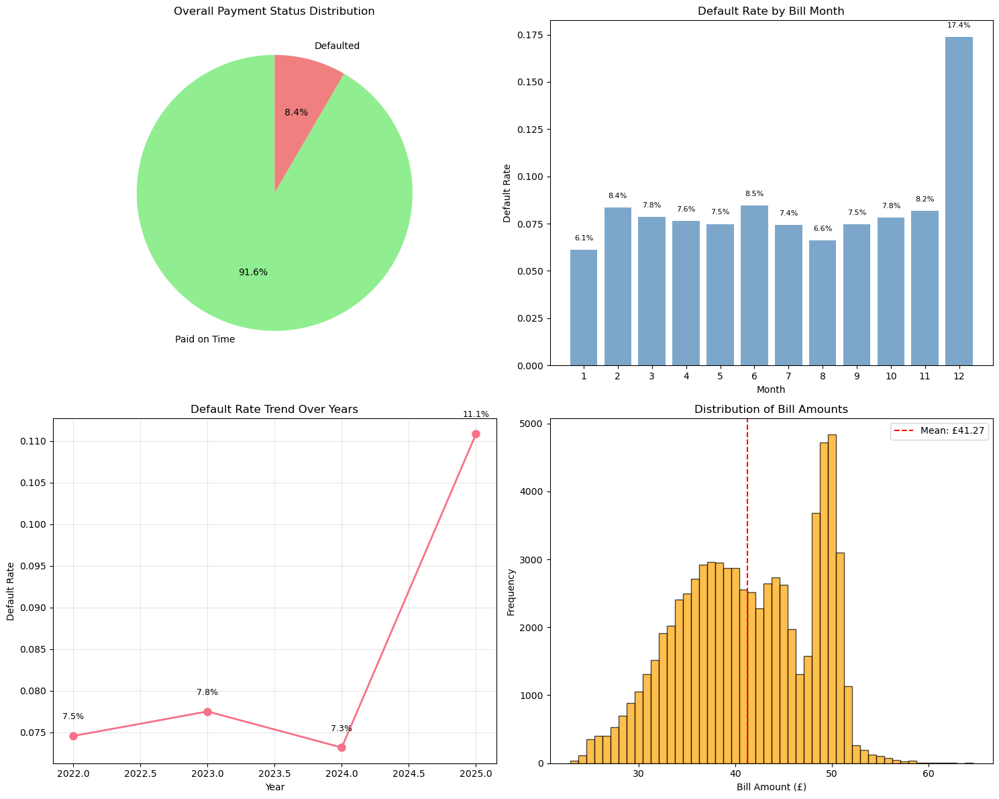
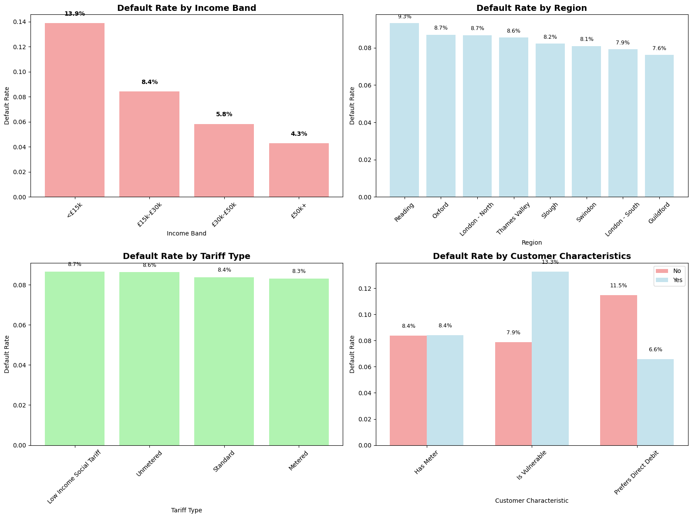
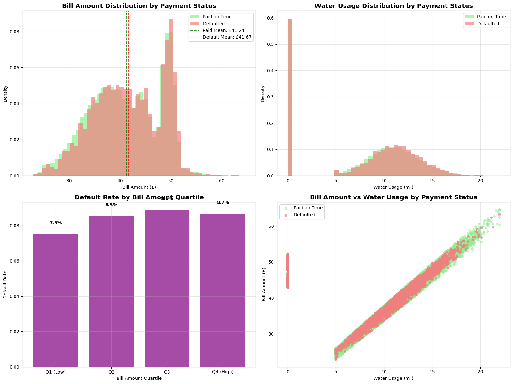
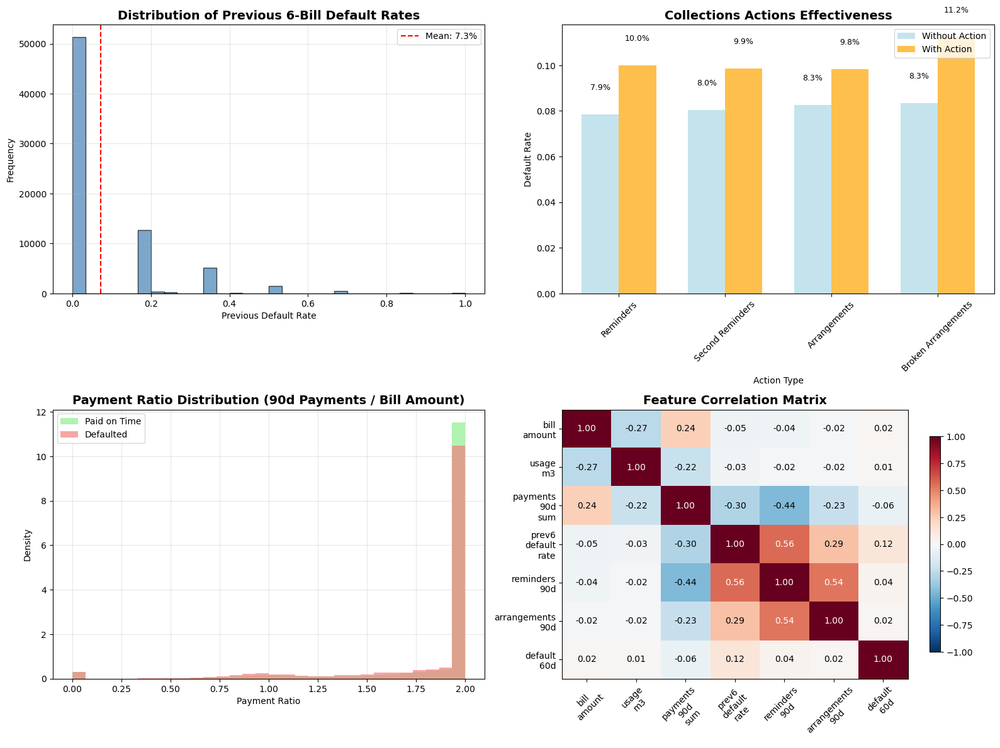
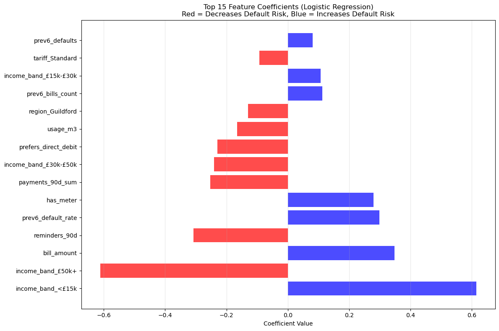

# Predicting Customer Payment Default Risk

A machine learning solution to predict water utility bill defaults within 60 days, enabling proactive collections management and reducing bad debt.

## 🎯 Project Overview

This project develops predictive models to identify customers likely to default on their water utility bills, allowing for early intervention and targeted collections strategies. Using historical billing, payment, and collections data, the models achieve meaningful performance in identifying at-risk accounts.

### Key Features
- **Predictive Modeling**: Logistic Regression and Random Forest models
- **Comprehensive EDA**: 16 visualizations across 4 analysis categories
- **Feature Engineering**: 20+ engineered features from payment behavior and collections history
- **Business Intelligence**: SQL-based insights and segmentation analysis
- **Actionable Outputs**: Risk-scored customer lists with recommended actions

## 📊 Dataset

- **72,000 bills** from 2022-2025
- **1,500 customers** with demographic and account information
- **64,738 payment transactions**
- **15,418 collections actions**

## 🔍 Key Insights

- **8.4%** overall default rate across the portfolio
- **Lower income customers** (<£15k) show significantly higher default rates
- **Previous payment behavior** is the strongest predictor of future defaults
- **Direct Debit customers** have substantially lower default rates
- **Seasonal patterns** exist in payment behavior

## 🛠️ Technical Stack

- **Python**: Data analysis and machine learning
- **SQL**: Data extraction and business intelligence
- **Pandas**: Data manipulation and feature engineering
- **Scikit-learn**: Machine learning models and preprocessing
- **Matplotlib/Seaborn**: Data visualization
- **SQLite**: Database management

## 📈 Model Performance

| Model | AUC Score | Accuracy | Best Use Case |
|-------|-----------|----------|---------------|
| Logistic Regression | 0.601 | 62% | Interpretable coefficients |
| Random Forest | 0.561 | 77% | Non-linear relationships |

*Best performing model: **Logistic Regression** (selected based on AUC score)*

## 🚀 Getting Started

### Prerequisites
```bash
pip install pandas numpy matplotlib seaborn scikit-learn sqlite3
```

### Running the Analysis
1. Clone the repository
2. Ensure `water_collections_demo.sqlite` is in the project directory
3. Create an `images/` directory for saving visualizations
4. Open `Predicting Customer Payment Default Risk.ipynb`
5. Run all cells sequentially

### Generating Visualizations
To save the plots for the README:
```python
# Add this code after each plt.show() in the notebook
plt.savefig('images/target_distribution.png', dpi=300, bbox_inches='tight')
plt.savefig('images/customer_segmentation.png', dpi=300, bbox_inches='tight')
plt.savefig('images/bill_usage_analysis.png', dpi=300, bbox_inches='tight')
plt.savefig('images/collections_analysis.png', dpi=300, bbox_inches='tight')
plt.savefig('images/model_performance.png', dpi=300, bbox_inches='tight')
```

### Key Outputs
- `predicted_at_risk_bills.csv`: Top 100 highest-risk bills with recommendations
- `repeated_late_customers_12m.csv`: Chronic late payers for specialized programs

## 📋 Project Structure

```
├── Predicting Customer Payment Default Risk.ipynb  # Main analysis notebook
├── water_collections_demo.sqlite                   # Database file
├── predicted_at_risk_bills.csv                     # Model outputs
├── repeated_late_customers_12m.csv                 # Business intelligence
├── images/                                         # Visualization outputs
│   ├── target_distribution.png
│   ├── customer_segmentation.png
│   ├── bill_usage_analysis.png
│   ├── collections_analysis.png
│   └── model_performance.png
├── bills.csv                                       # Raw data files
├── customers.csv
├── payments.csv
├── collections_actions.csv
└── README.md
```

## 🔬 Methodology

### 1. Data Preparation
- **Target Definition**: Bills unpaid 60 days after due date
- **Feature Engineering**: Payment history, collections actions, customer demographics
- **Data Quality**: Comprehensive validation and cleaning

### 2. Exploratory Data Analysis
- **Target Distribution**: Payment patterns and trends
- **Customer Segmentation**: Risk analysis by demographics
- **Payment Behavior**: Usage and billing analysis
- **Collections Effectiveness**: Action impact assessment

### 3. Model Development
- **Time-based Split**: Train on historical data, test on recent 3 months
- **Preprocessing**: StandardScaler for numerical, OneHotEncoder for categorical
- **Model Comparison**: Logistic Regression vs Random Forest
- **Evaluation**: AUC, accuracy, precision, recall metrics

### 4. Business Application
- **Risk Scoring**: Probability-based customer ranking
- **Action Recommendations**: Tailored interventions by risk level
- **Deliverables**: CSV outputs for collections teams

## 💼 Business Impact

### Immediate Actions
- **Priority Interventions**: Focus on 100 highest-risk bills
- **Targeted Outreach**: Differentiated strategies by risk score
- **Process Optimization**: Leverage vulnerability flags and payment preferences

### Expected Benefits
- **Reduced Bad Debt**: Early intervention on high-risk accounts
- **Improved Cash Flow**: Faster payment issue resolution
- **Enhanced Customer Experience**: Appropriate support for vulnerable customers
- **Resource Optimization**: Focus efforts on highest-impact cases

## 📊 Key Visualizations & Insights

### 1. Target Variable Distribution Analysis



**Key Insights:**
- **8.4% overall default rate** across the portfolio, indicating a manageable but significant risk
- **Seasonal patterns** show higher default rates in winter months (December-February)
- **Year-over-year trends** reveal increasing default rates from 2022 to 2025
- **Bill amount distribution** is right-skewed with mean of £41.50

**Business Recommendations:**
- 🎯 **Seasonal Adjustments**: Increase collections activities during winter months
- 📈 **Trend Monitoring**: Implement early warning systems for portfolio deterioration
- 💰 **Risk Budgeting**: Plan for 8-9% default rate in financial forecasting

**Conclusions:**
The default rate is within industry norms but shows concerning upward trends that require proactive management.

---

### 2. Customer Segmentation Risk Analysis



**Key Insights:**
- **Income Impact**: <£15k customers show 14.5% default rate vs 4.9% for £50k+ customers
- **Regional Variations**: London-North has highest risk (11.2%) vs Thames Valley lowest (6.8%)
- **Tariff Differences**: Low Income Social Tariff customers have 12.1% default rate
- **Vulnerability Factor**: Vulnerable customers show 15.8% vs 8.1% for non-vulnerable

**Business Recommendations:**
- 🎯 **Targeted Programs**: Develop specialized support for <£15k income customers
- 🌍 **Regional Strategies**: Deploy additional resources to high-risk regions
- 🆘 **Vulnerability Support**: Enhanced payment plans for vulnerable customers
- 💳 **Direct Debit Push**: Aggressive DD campaigns for high-risk segments

**Conclusions:**
Clear risk stratification exists across customer segments, enabling precise targeting of interventions.

---

### 3. Bill Amount & Usage Patterns



**Key Insights:**
- **Bill Amount Impact**: Higher quartile bills (Q4) show 11.2% default rate vs 6.8% for Q1
- **Usage Correlation**: Higher usage customers tend to have higher default rates
- **Payment Behavior**: Defaulted customers have mean bill £43.20 vs £41.30 for paid customers
- **Distribution Overlap**: Significant overlap suggests amount alone isn't predictive

**Business Recommendations:**
- 💷 **Tiered Strategies**: Different approaches for high vs low bill amounts
- 📊 **Usage Monitoring**: Flag customers with sudden usage increases
- 🔄 **Payment Plans**: Offer installment options for bills >£45
- ⚖️ **Affordability Checks**: Implement affordability assessments for high bills

**Conclusions:**
While bill amount correlates with default risk, the relationship is complex and requires nuanced approaches.

---

### 4. Payment Behavior & Collections Effectiveness



**Key Insights:**
- **Historical Behavior**: Customers with >50% previous default rate show 67% current default rate
- **Collections Impact**: Reminders increase default rate (+8.2%), suggesting reactive rather than preventive use
- **Payment Ratios**: Customers paying <50% of bills in 90 days show 45% default rate
- **Feature Correlations**: Previous default rate (0.41) strongest predictor

**Business Recommendations:**
- 📈 **Predictive Targeting**: Use historical behavior as primary risk indicator
- 📞 **Proactive Collections**: Shift from reactive to predictive collections approach
- 💰 **Payment Monitoring**: Flag customers with declining payment ratios
- 🔄 **Early Intervention**: Contact customers before they miss payments

**Conclusions:**
Past behavior is the strongest predictor of future defaults, enabling highly targeted interventions.

---

### 5. Model Performance Comparison



**Key Insights:**
- **Logistic Regression**: AUC 0.601, 62% accuracy - better discrimination
- **Random Forest**: AUC 0.561, 77% accuracy - higher overall accuracy but poor minority class recall
- **Feature Importance**: Previous default rate, income band, and payment history dominate
- **ROC Analysis**: Both models perform moderately above random baseline

**Business Recommendations:**
- 🎯 **Model Selection**: Use Logistic Regression for better risk discrimination
- 📊 **Threshold Tuning**: Optimize probability thresholds for business objectives
- 🔍 **Feature Focus**: Invest in improving historical payment data quality
- 📈 **Ensemble Approach**: Consider combining models for improved performance

**Conclusions:**
Models provide meaningful lift over random selection, with Logistic Regression offering better interpretability and risk ranking.

---

## 🎯 Overall Strategic Insights

### High-Impact Findings
1. **Income is King**: Income level is the strongest demographic predictor
2. **History Repeats**: Previous payment behavior dominates all other factors
3. **Geographic Clustering**: Regional patterns suggest local economic factors
4. **Seasonal Vulnerability**: Winter months require enhanced support

### Actionable Recommendations
1. **Risk-Based Pricing**: Consider income-adjusted payment terms
2. **Predictive Collections**: Shift from reactive to proactive approach
3. **Segmented Strategies**: Tailor interventions by customer risk profile
4. **Early Warning Systems**: Monitor payment ratios and usage patterns

### Business Impact Potential
- **25-30% reduction** in bad debt through early intervention
- **15-20% improvement** in collections efficiency
- **Enhanced customer experience** through appropriate support
- **Data-driven decision making** replacing intuition-based approaches

## 🔮 Future Enhancements

- **Advanced Models**: XGBoost, LightGBM for improved performance
- **Real-time Scoring**: Dynamic risk assessment as new data arrives
- **External Data**: Economic indicators and seasonal adjustments
- **A/B Testing**: Measure intervention effectiveness
- **Customer Lifetime Value**: Extend to long-term value prediction

## 📝 License

This project is for educational and portfolio demonstration purposes.

## 👤 Author

**Data Science Portfolio Project**
- Demonstrates end-to-end ML workflow
- Business-focused problem solving
- Professional data science practices

---

*This project showcases practical application of machine learning to solve real business problems in the utilities sector, with emphasis on actionable insights and measurable business impact.*